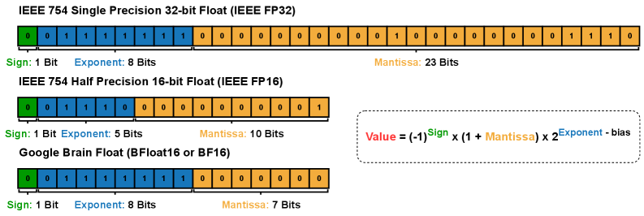

### Title: ScaleLLM: A Resource-Frugal LLM Serving Framework by Optimizing End-to-End Efficiency
Institution: TensorOpera Inc   
Conference: ArXiv Sep 10 2024    
Paper Link: https://arxiv.org/html/2408.00008v1

##### Key Point
- Existing works only focus on optimizing individual subprocedures of LLM serving, but in commercial LLM applications, end-to-end latency, introduced from functionalities of the gateway, becomes the most significant bottleneck.
- Solutions:
    - 1, proposed a new router frameworks to reduce the gateway latency
    - 2, Load balance across multiple replicas of LLM service
        - Low concurrency (< 64 requests). Route requests to nodes with fewer replicas but higher tensor parallelism to optimize resource utilization for smaller batch computations.
        - High concurrency (≥ 64 requests). Route requests to nodes with more replicas but lower tensor parallelism, effectively distributing the workload to squeeze everything out of available compute by leveraging the power of replica parallelism.

### Understanding and Mitigating Numerical Sources of Nondeterminism in LLM Inference

- BF16 vs. FP16：为什么FP16更deterministic？
    - BF16的尾数更短 （7bits <-> 10bits）,精度更低
    - BF16 的范围更大，不容易导致溢出
    - 从LLM推理角度，token level deterministic
        - top-1 与 top-2 的概率差（logit gap）本来就很小，尤其是 reasoning model；
        - 低精度的舍入误差会让 top-1/top-2 差异更小


- LayerCast
    - Weights/bias 继续使用 BF16 存储
    - 计算使用FP32处理；开销doubling the memory usage and inference time compared to BF16
    - 对比top1的概率变化方差，FP32 < FP16 < BF16
    - 测试结果：
    
    ```py
    # Pure BF16 (BF16 storage + BF16 compute)
    # LayerCast (BF16 storage + FP32 compute)
    LayerCast 方法比纯 BF16 方法慢约 3.44x。
    (1.294 s vs. 4.455 s)
    ```
- 只针对 规约 操作，尝试 FP32 规约，计算量减少
    - （1）：BF16 + atomicAdd 
    - （2）：FP32 + atomicAdd -> BF16
    - （3）：bit by bit add
    - （1）,（2） 之间比较latency， （2）,（3） 比较deterministic
    - 先比较 accuracy -> matmul 这个算子的accuracy；不同token输入 -> 不同GEMM的output
        - BF16，bit-by-bit比较
        - error distribution
        - 原始的BF16 + 原始FP32 + 新的FP32
- **拆分每一层/算子的 deterministic 影响 + 计算量**
    - GEMM
- Split-K的问题，类似TP的方法实现树状结构的规约（性能）
    - 固定S