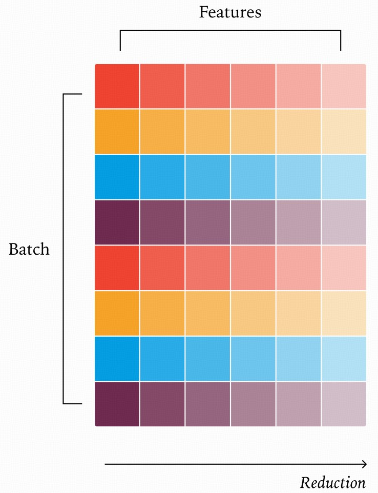

## Post-Training RL中的parameter同步
- [link](https://abcdabcd987.com/2025/09/07/rl-weight-transfer/)
    - 而 PyTorch 的 kernel 调用其实也都只是把操作提交到 Cuda Stream，所以除非我们显式地要求同步，不然这些 GPU 操作也不会阻塞我们的 Python CPU 线程。
    - Post-Training -> Infer 原地替换可能存在的问题：
        - 混合参数问题 (1.Xs 也已经执行多轮iteration了)
        - KV-Cache复用问题
            - slime中提到了在更新参数之后，清空kv-cache/radix-ree (貌似只影响复用的kv-cache？)
    - 博客里提到的实际带宽仅 5.X GB/s; 距离理论带宽(50GB/s)和one-one场景下的36GB/s仍然差距明显
    - 当前的负载均衡：统计每个训练 GPU 需要传输的字节数。对于每个参数，每个推理 GPU 都选择当前累计传输字节数最小的训练 GPU 作为源

- update_weights_from_disk
- update_weights_from_tensor
- update_weights_from_distributed (nccl/IB, disaggregated)

- slime 框架
    - [code-link](https://github.com/THUDM/slime/blob/main/README_zh.md)
    - [blog](https://zhuanlan.zhihu.com/p/1925210722704531547)
    - 训练侧使用 Megatron，做前向/反向和optimizer，rollout侧使用Sglang，批量生成样本和reward
    - 支持同步训练(train.py) 和 异步训练(train_async.py)
        - 同步模式：先采满，再训练；串行推进
            - rollout生成 -> 训练(耗净rollout生成的样本) -> 权重更新到rollout侧(广播) -> 下一轮rollout生成 -> ...
        - 异步模式：(Full Async)
            - rollout worker 和 training worker 各自执行，通过队列完成数据交互(producer - consumer)
            - 权重热更新 (依赖disaggregated架构，通过 rollout_manager.async_generate 和 actor_model.async_train 进行训推分离的异步训练，rollout 始终领先 train 一个 step)
    - 权重更新 -> 阻塞RL的位置
        - 同步更新,rollout 和 trainer 相互依赖，交替暂停
        - 更新权重时，rollout为了完全一致(避免一半旧权重，一半新权重)，会暂时停止处理新请求，并在处理完旧请求之后，才开始执行权重同步 -> rollout吞吐量为0  [版本共存解决]
        - colocated资源竞争 -> 旧权重 + 新权重
    - 权重同步策略：
        - co-located
            - 训练过程：在 co-locate 策略下，rollout engine 和 training engine 需要不断 offload 与 upload，来互相让出显存(避免OOM)。SGLang 通过 torch memory savor 进行 offload 管理，而 Megatron 通过 CuMemAllocator 进行 offload 管理。从逻辑上，Rollout 结束后，通过 mem savor 直接 release 掉物理占用，然后启动 megatron 进行训练。训练结束后，将 megatron 的 model weights 和 optimizer 全都 offload 到 CPU 上(也是为了避免OOM)，然后将 SGLang 的 model weights 还有 KV cache upload 到 GPU 上。
            - 更新过程：
                - _preprocess_tensor_for_update_weights聚合当前参数的完整tensor，导致GPU中这个parameter会有3份(training FSDP 1份， gather后的tensor一份(eg TP=4； [256,1024] -> [1024,1024])， sglang一份)
                - tensor序列化([1024,1024])，返回一个hanle tuple (包含tensor的地址，stripe，size等meta data)
                - 传递handle tuple给sglang，sglang通过 LocalSerializedTensor.get -> MultiprocessingSerializer.deserialize 从地址处恢复parameters
            - 问题：
                - 1，为什么要序列化 - 反序列化 (不同线程/framework，需要序列化->交互->反序列化)
                - 2，gather tensor之后出现三份 parameters，不会OOM？
                - 3，update_weights_from_tensor 看起来是将地址交换给了 infer，为什么还需要to disk? (地址交换不能跨进程)
                - gather之后的handle tuple 发生在rank 0上，会对rank 0的内存开销造成多大影响？此时rank 0 上存储了全部的tensor吗？(按照gather逻辑，应该是保存了全部的tensor，不会OOM吗)
        - disaggregated 方法 (默认trainer / rollout完全解耦)
            - trainer 触发，通过HttpServerEngineAdapter调用Sglang侧的更新结构；Sglang通过 update_weights_from_distributed 热更新权重
            - 数据传输通路：
                - meta data(name/shape/dtype/...) 通过http rest交互；告诉对方哪些参数需要更放心
                - 权重本体通过 NCCL/torch.distributed 进行广播

## Non-associativity in LLM
- [Link](https://thinkingmachines.ai/blog/defeating-nondeterminism-in-llm-inference/)
- 浮点数计算的非结合性(具有不同的"小数位数"时)
```py
import random

vals = [1e-10, 1e-5, 1e-2, 1]
vals = vals + [-v for v in vals]

results = []
random.seed(42)
for _ in range(10000):
    random.shuffle(vals)
    results.append(sum(vals))

results = sorted(set(results))
print(f"There are {len(results)} unique results")

# Output:
# There are 102 unique results
```
- GPU上的原子操作(类似"原子加法")时"非确定性的"
    - 涉及多个SM核心参与同一个向量的规约，执行顺序完全取决于哪个核心先完成计算
- 对LLM推理的影响：“Batch Invariance”
    - 什么是Batch Invariance: 指的是只要输入prompt一致，template=0时，应该保证结果一致 （系统状态/负载不应该影响结果）；
    - 但是在实际LLM推理过程中，批次或负载变化 → shape / 分块策略 / 通信拓扑改变 → 浮点运算的次序改变 → 数值路径不同 → 违反批量不变。
        - 不同的batch size，导致切换不同的kernel (autotuning)；即使是同一个kernel，不同的shape也会导致每个SM 负责的tokens变化
        - LayerNorm/RMSNorm, Matmal, Attention(FlashAttention 依赖Split-K)
        - 改变的kernel会影响"归约"顺序： 比如原本一个vector的计算交给一个SM核心 改为由两个SM核心计算
    - 影响：即使temperature = 0， 也会返回不同的结果：(作者在vLLM下执行推理，相同prompt采样1000次得到了 80 个不同的结果)
    - 为什么Batch Invariance重要？
        - 训练 vs 推理 forward 不一致： RL、蒸馏这类 on-policy 逻辑里，假设“used for training 的 logits = inference 时的 logits”，但实际：同一条数据，训练 forward 和推理 engine forward 不完全一样（因为运行环境、batch、kernel 不同），等价于偷偷变成 off-policy，影响收敛/稳定性。
        - 系统层面的 reproducibility 要求变高：做 benchmark 要可重复；而且不一致导致线上回放（replay logs）时无法还原“当时的决策”
    - 从算子角度解决计算的：
        - 构造具备"批次不变性"的kernel；要求无论kernel的批次大小如何，每个元素的归约顺序都必须固定。
        - 最简单的，在kernel计算时，要求每一行交给一个kenel计算；这样在batch_size大的时候可以利用GPU SM的并行性，当batch_size比较小的时候，就会造成部分SM闲置等待
        
        - 其他的Matmal 和 Attention 也follow类似的设计
        - 初步实现之后，能够实现批次不变性(1000次采样得到相同的结果；但是延迟增加了61.5%)
    - 这个问题SGlang中已经做了集成[link](https://lmsys.org/blog/2025-09-22-sglang-deterministic/); 通过"--enable-deterministic-inference + --disable-radix-cache" 开启
- 问题：
    - 性能损失: Batch-Invariant 要求GPU在不同 batch 下走相同的计算路径 → 把 GPU 里所有的动态调优、动态切分、动态并行、动态缓存复用通通锁死了；(sglang当前版本仍造成34.35%的性能损失)
    - sglang/vllm 现有framework支持受限 (现有方法在追求最大化吞吐量，尽可能并行计算  <-> 计算顺序变化)
        - continuous batching: request 放在不同batch size下，
        - Attention Kernel (FlashAttention)
        - block KV-Cache的影响 ()
    - 尝试build 一个新的framework specifical的model
        - case test
        - nccl - 本身就不deterministic，有可能与 rounding 有关 （FP16 -》 FP32 计算 -〉 FP16）
        - 迭代的速度
        - https://hazyresearch.stanford.edu/blog/2025-05-27-no-bubbles 
        - https://github.com/HazyResearch/ThunderKittens
        - 哪些component不是deterministic，以及perf loss