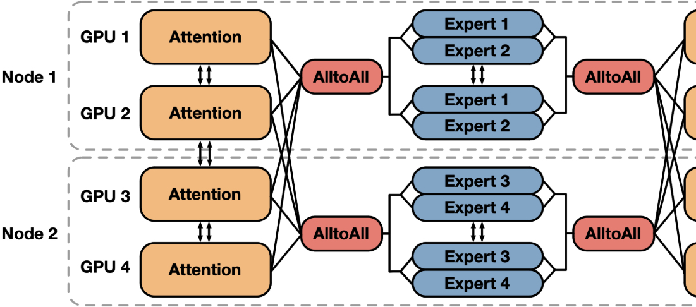

## Batch-Invariance

### Blog from Thinking Machine Lab
- [Link](https://thinkingmachines.ai/blog/defeating-nondeterminism-in-llm-inference/)
- 浮点数计算的非结合性(具有不同的"小数位数"时)
```py
import random

vals = [1e-10, 1e-5, 1e-2, 1]
vals = vals + [-v for v in vals]

results = []
random.seed(42)
for _ in range(10000):
    random.shuffle(vals)
    results.append(sum(vals))

results = sorted(set(results))
print(f"There are {len(results)} unique results")

# Output:
# There are 102 unique results
```
- 假说：GPU上的并行规约：浮点非结合律 + 规约顺序改变
    - 涉及多个SM核心参与同一个向量的规约，执行顺序完全取决于哪个核心先完成计算
        - 对向量规约 $S = \sum_{i=0}^{N-1}x_i$; GPU常见是将vector切分成多段，交给多个thread block（每个block 被调度到某个SM上计算）。每个block/SM内的本地规约通常是相对可控的。
        - 但是跨SM合并（atomicAdd，全局加法）顺序取决于到达顺序：$atomicAdd(&S, p_*)$
    - atomicAdd确保每个SM的result都被处理，但不保证顺序
- 实际上：问题源头并不是来自于“GPU本身并行就不确定”；而是kernel选择
    - Why 这么说？
        - 上面的atomicAdd确实会导致这个nondeterministic的问题，但是绝大部分kernel中没有atomicAdd ops
        - 在典型的LLM forward过程中，不含atomicAdd操作？
            - token embedding, RoPE, activation, bias Add, Residual Add 都是per-token ops，无规约
            - RMSNorm/layernorm，GEMM(mutmal)，Softmax 有规约，但是不依赖atomicAdd
                - 以GEMM为例，大部分工程上几乎都按照 output tile来划分，不需要在规约维度上并行化
                - 类似“树状”规约的策略，可以实现确定性 + 不牺牲性能
        - 结果：使用相同的kernel，可以保证deterministic；
    - 为什么说kernel选择才是问题源头呢？
        - 选择不同的kernel，会导致：$(a+b+c)+(d+e+f) \neq (a+b)+(c+d)+(e+f)$
        - 为了得到最佳效率，对于 matmul / attention 这类带 reduction 的 kernel，会根据 batch 大小、形状动态选择不同的分块 / split-K / tensor core 指令。
        - 例子：Mutmal/GEMM: $C = A x B$; 其中A是activation，shape=[M,K], B是权重，shape=[K,N]
            - 对于标准output-tile GEMM, 按照 M 划分block, 此时假设 $M=batch_size=1$, 那么划分之后只有一个block，即只有一个MAC参与计算，其他MAC闲置 => 利用率低
            - 对split-k + Add方法
                - 按照K维度，分为 S 份，每个[1, K/S]块被分到一个block；分给 M*S 个MAC计算后再规约
                - atomic合并，导致non-determinstic （最常见，vllm/sglang的deterministic常见都需要关闭split-k）
            - 实际情况：对于M很小，会开启split-k，但是随着M增加，output-tiles 变多，S会减小甚至关闭split-k；这样就导致了batch variance
    - 问题定义“batch invariance”: 
        - 对同一个样本，无论它是在 batch_size=1 跑，还是和其他请求一起 batch_size=32 跑，甚至 batch 内位置变化，该样本的每一步数值轨迹都要一模一样
    - Horace的方案是：重写RMSNorm/matual/attention这三个关键op，保证其 reduction 方式对 batch尺度 / chunking / prefix caching 不敏感，包括：
        - RMSNorm：
        ```py
        # x: [batch_size, hidden_dim]
        def rms_norm(x, weight):
            return x * torch.rsqrt(torch.mean(x ** 2, dim=-1, keepdim=True)) * weight
        ```
            - 修改前：
                - 大 batch 时：data-parallel，每个 batch element（一行）交给一个 core/SM，整条向量的 mormalization 在该 core 内完成。
                - 小 batch 时：为了“把所有 SM 喂饱”，会启用 split-k reduction：一个向量被拆成多个 chunk，分给多个 core 做局部 sum，再在最后合并。 => 可能会导致顺序改变
            - 修改后：
                - 坚持使用data parallel, 每个element的normalization始终由一个core持有并完成；batch增大时，就多开启一些thread block；小 batch 时，牺牲并行度。
        
        
        - Matmul：
            - 修改前：如前面所述
            - 修改后：
                - 只按照output tiles做data parallel，不再拆分K维度；同时禁用 split-K/stream-K、动态tensor core等策略
                - 相比于cuBLAS，损失了~20% 的性能，小batch时更明显
        
        - Attention：
            - 比较复杂，在feature dim 和 sequence dim上分别进行规约
            - 修改前（以FlashAttention2为例）：
                - 并行策略：data-parallel in Q，reduce over K/V
                - 在如vllm的系统中，会结合
                    - KV-Cache单独处理：
                        - Paged KV-Cache / Chunked prefill
                        - KV-Cache不连续 => 计算时对于每一个KV-Cache block分别规约(P_cache)，再对当前新token的KV block规约(P_current); 最后再合并
                        - example
                        ```shell
                        想象 KV cache 有 80 个 token，新来 48 个 token：
                        实现 A：把 80 个 cache 元素分成 3 个 block（两满一残），48 个新元素分成 2 个 block ⇒ 总共 5 个 block 的规约。
                        实现 B（比如一次性处理 128 个元素，没有 cache 概念）：用 4 个 block 规约。
                        ```
                    - Split-KV/FlashDecoding
                        - decode 阶段 query length 很小，几乎无法沿 Q 并行，所以会沿 KV 长度方向拆分，多个 core 处理不同 KV 区间，再合并 => 块间顺序改变
                        - 给定需要的并行度，算出“需要 𝑆 个 split”，然后把 KV 长度 𝐿 均匀分成 𝑆 段，每段长度约 𝐿/𝑆。 => 分块改变会导致顺序改变 (a|bc vs. ab|c)
            - 修改之后：
                - 统一KV布局，消除"KV-Cache 和 当前token"的分开规约 => 连续起来
                    - update the KV cache and page table before the attention kernel itself, ensuring that our keys and values are always consistently laid out regardless of how many tokens are being processed.
                    - kernel 内部不再区分“cache 部分”和“当前 token 部分”，只是在一个统一的 K 维度上规约。
                - 选择一个固定的 split 大小 𝐶（例如 256），对任意 KV 长度 𝐿，按 [0:𝐶),[𝐶:2𝐶),… 切分，最后一段可能是残长 ≤𝐶。
                    - 合并阶段也固定为“按这些固定 index 区间的顺序做规约”
    - 影响： 初步实现之后，能够实现批次不变性(1000次采样得到相同的结果；但是延迟增加了61.5%)

### vLLM中的适配
- link: https://docs.vllm.ai/en/latest/features/batch_invariance/
- 提供开关： “VLLM_BATCH_INVARIANT=1”；
- 开发中，目前支持部分硬件 + 部分模型；开启后会禁用某些可能引入不确定性的优化(例如张量并行模式下的自定义 all-reduce 操作)6
- 适配PR(https://github.com/vllm-project/vllm/pull/24583)
    - 在 FlexAttention backend 里固定 BLOCK_M/BLOCK_N/IS_DIVISIBLE 等 kernel 配置，让 attention kernel 的 tile / mask 行为固定下来；(https://arxiv.org/pdf/2412.05496)
    - 再配合 batch_invariant_ops 里对 torch.mm/addmm/mean/log_softmax 的 override，替换 PyTorch 默认的 matmul/reduction kernels。
    - 固定 tile / 固定 split 规则 + 统一 KV logical layout
    - 对 KV-cache, 内存仍是 paged/block pool;会通过更新page table的方式将cache + current tokens 统一成一个逻辑序列。
    - 即 不用砍掉 PagedAttention 的内存管理，只是要换一套 batch-invariant attention backend 来吃这套布局

### sglang中的适配
- 这个问题SGlang中已经做了集成[link](https://lmsys.org/blog/2025-09-22-sglang-deterministic/); 通过"--enable-deterministic-inference + --disable-radix-cache" 开启
- 适配PR: https://github.com/sgl-project/sglang/issues/10278
- 目标：
    - Attention Backend（FlashInfer / Triton / FA3）
    - NCCL 通信（TP 下 deterministic all-reduce）
    - Radix Cache Support：“Making Prefill with Radix Cache has the same output as Prefill without Radix cache”
- 目前的问题：
    - 性能损失: Batch-Invariant 要求GPU在不同 batch 下走完全相同的计算路径 → 把 GPU 里所有的动态调优、动态切分、动态并行、动态缓存复用通通锁死了；(sglang当前版本仍造成34.35%的性能损失)

### KV-Cache管理
- 并不要求物理上联系的KV-Cache管理，依旧可以复用paged/block KV-Cache管理
- 在进attention kernel之前，通过更新page table / metadata，将同一个sequence的KV-Cache 和 current KV以一致的逻辑顺序呈现。
- 固定 tile / 固定 split 规则 + 统一 KV logical layout

### 从系统角度
    - [sglang](https://github.com/sgl-project/sglang/issues/10278)
    - [vllm](https://github.com/vllm-project/vllm/issues/27433)

| Component | 为什么会影响 deterministic / batch-invariant inference | vLLM 现状 | SGLang 现状 |
| --------- | ---------------------------------------------------- | -------- | ---------- |
| **RMSNorm / LayerNorm / mean / log_softmax 等 reduction op**    | reduction 常用 **split-reduction / atomic / warp-level**，reduction 的分块策略会随 batch shape 变，导致浮点加法顺序变化（非结合性） | 集成了 batch_invariant_ops kernels。 **TP>1：✅；**  | 同vLLM。 **dense TP=1：✅；** |
| **Matmul / Linear GEMM**   | GEMM 常用 **split-K / block swizzle / different tile config**；在不同batch下会走不同 kernel =》不同 reduction 树。| 初步集成了batch_invariant_ops matmul, **dense TP=1：✅；量化/fused GEMM/TP：⚠️**  | 同vLLM。 **dense TP=1：✅；MoE/TP/fused GEMM：⚠️**  |
| **Attention**  | decode 侧常需要 **Split-KV / FlashDecoding**；很多实现会根据“当前 batch 并发/seq 分布”动态决定 split 数或 split size → reduction 顺序变化。 | vLLM 提供 **fixed split-KV size** attention 实现；支持FlashInfer/TRITON_MLA 等）。 **dense：✅；更多后端/特性：⚠️** | SGLang在 **fixed split-KV size** 的 batch-invariant attention基础上，支持了 FlashInfer / FA3 / Triton 多后端。但 FA3 目前只能 num_splits=1 **dense：✅** |
| **Chunked Prefill**  | 长序列通常被切成多个 chunk 逐步送入 KV cache。若 chunk 的切分点根据当前 batch 负载动态调整，同一长序列在不同并发度下会被切成不同的段，每段参与 attention/reduction 的方式就不同，造成数值路径差异。 | **-** | **单卡 dense：✅；和 radix cache/大 TP 联动仍在演进：未完全覆盖**  |
| **KV cache/Paged/Radix Attention** | KV cache 在内存中的布局会决定 attention kernel 如何读取和分块。如果不同 batch 场景下 page/segment 合并、prefix 共享/重排方式不同，同一 token 在 kernel 中所参与的分块结构会不同，从而改变 reduction 顺序。 | **基础 paged KV + 单卡 dense OK；更激进的缓存/压缩：未完全覆盖。**   |  **✅普通 KV：✅；radix cache：目前暂不支持（为 determinism 关闭）**  |
| **TP 通信：All-Reduce / 自定义 all-reduce / NCCL 算法选择**  | 行并行层需要 all-reduce；不同 TP size / 不同 NCCL 算法（ring/tree）会改变 reduction 顺序 | **TP>8 supported：✅**  | Support TP with deterministic all-reduce kernels **TP>1:✅** |
| **MoE + EP（all-to-all / token dispatch）**  | MoE 的 token dispatch 常涉及 **动态分桶、all-to-all、padding/pack**；不同 batch 下 token 分配/排序会变，导致聚合/归并顺序变化；再叠加通信与 fused kernel，极易破坏 determinism。  | **MoE/TP：✅, EP:⚠️**   | **MoE/TP：✅，EP：⚠️** |


### 其他问题
- Posttraining 前向和反向之间share 中间结果吗？
    - Rollout阶段（推理）
        - SGLang 接收 prompt → 前向生成 output tokens、logprobs、value predictions（如果 actor-critic 模型）
        - SGLang 不保留（或只轻微保留）用于推理的中间 activations；主要保存生成的结果数据（比如 sequence, logprob, value）
        - 这些生成数据被送入训练数据池
    - 训练阶段
        - Megatron 从数据池读入生成数据 +原始状态
        - Megatron 加载当前模型权重（可能已被从推理端同步）
        - Megatron 对输入（相同 prompt）执行 自己的前向（产生 activations）→ 计算 loss（如 policy loss, value loss, critic loss）→反向更新权重
        - 更新后的权重再同步回推理端（SGLang）用于下一轮rollout

- NCCL中的deterministic
    - NCCL 负责的是多卡之间的 all-reduce / all-gather / reduce-scatter 等通信
    - NCCL 的 ring / tree / hierarchical 算法会按拓扑做分段加法，顺序可能随进程数量、分组策略变化而变化
    - 新版 NCCL 提供了一些 环境变量, 确保在 同一个并行配置(拓扑/rank等)下，尽量保证运算路径固定，使多次运行结果稳定 =>  **需要在上层保证每次all-reduce的参与rank，tensor切分方式，调用顺序一致**


## MoE gating 是batch-invariant
$${(e_1, w_1),(e_2, w_2)} = topk(softmax(matmul(w_{gate}, input)))$$

- Test 过程
    - matmul/attention等模块 替换成 batch_invariant_ops 的版本
    - 检测 first MoE Gating layer 的输入/router_logits/输出

- 结果
    - 是batch-invariant

- 第一版测试因为 Gating 中的 Matmul 没有替换，测试出不同的结论
    - 根因分析
        - Gate Input: 100% 相同 (0.0000000000e+00)
        - Raw Router Logits: 出现差异(6.2500000000e-02) — 根因
        - Softmax Probabilities: 差异被放大 (1.1757239699e-03)
        - Top-k Expert Indices: 3.1% 的 expert 选择改变
        - 根因：Gate computation (Linear layer) 的 matmul 操作不是 batch-invariant
        - 影响链：Raw Logits → Softmax → Top-k Selection

- Qwen2MoE source code
```py
class Qwen3MoeExperts(nn.Module):
    """Collection of expert weights stored as 3D tensors."""

    def __init__(self, config):
        super().__init__()
        self.num_experts = config.num_experts
        self.hidden_dim = config.hidden_size
        self.intermediate_dim = config.moe_intermediate_size
        self.gate_up_proj = nn.Parameter(torch.empty(self.num_experts, 2 * self.intermediate_dim, self.hidden_dim))
        self.down_proj = nn.Parameter(torch.empty(self.num_experts, self.hidden_dim, self.intermediate_dim))
        self.act_fn = ACT2FN[config.hidden_act]

    def forward(
        self,
        hidden_states: torch.Tensor,
        top_k_index: torch.Tensor,
        top_k_weights: torch.Tensor,
    ) -> torch.Tensor:
        final_hidden_states = torch.zeros_like(hidden_states)
        with torch.no_grad():
            expert_mask = torch.nn.functional.one_hot(top_k_index, num_classes=self.num_experts)
            expert_mask = expert_mask.permute(2, 1, 0)
            expert_hit = torch.greater(expert_mask.sum(dim=(-1, -2)), 0).nonzero()

        for expert_idx in expert_hit:
            expert_idx = expert_idx[0]
            if expert_idx == self.num_experts:
                continue
            top_k_pos, token_idx = torch.where(expert_mask[expert_idx])
            current_state = hidden_states[token_idx]
            gate, up = nn.functional.linear(current_state, self.gate_up_proj[expert_idx]).chunk(2, dim=-1)
            current_hidden_states = self.act_fn(gate) * up
            current_hidden_states = nn.functional.linear(current_hidden_states, self.down_proj[expert_idx])
            current_hidden_states = current_hidden_states * top_k_weights[token_idx, top_k_pos, None]
            final_hidden_states.index_add_(0, token_idx, current_hidden_states.to(final_hidden_states.dtype))

        return final_hidden_states


class Qwen3MoeTopKRouter(nn.Module):
    def __init__(self, config):
        super().__init__()
        self.top_k = config.num_experts_per_tok
        self.num_experts = config.num_experts
        self.norm_topk_prob = config.norm_topk_prob
        self.hidden_dim = config.hidden_size
        self.weight = nn.Parameter(torch.zeros(self.num_experts, self.hidden_dim))

    def forward(self, hidden_states): # [batch_size=2, seq_len=100, hidden_num=1024]
        hidden_states = hidden_states.reshape(-1, self.hidden_dim)
        router_logits = F.linear(hidden_states, self.weight)  # (seq_len, num_experts)
        router_logits = torch.nn.functional.softmax(router_logits, dtype=torch.float, dim=-1)
        router_top_value, router_indices = torch.topk(router_logits, self.top_k, dim=-1)  # (seq_len, top_k)
        if self.norm_topk_prob:
            router_top_value /= router_top_value.sum(dim=-1, keepdim=True)
        router_top_value = router_top_value.to(router_logits.dtype)
        router_scores = router_top_value
        return router_logits, router_scores, router_indices


class Qwen3MoeSparseMoeBlock(nn.Module):
    def __init__(self, config: Qwen3MoeConfig):
        super().__init__()
        self.experts = Qwen3MoeExperts(config)
        self.gate = Qwen3MoeTopKRouter(config)

    def forward(self, hidden_states: torch.Tensor) -> tuple[torch.Tensor, torch.Tensor]:
        batch_size, sequence_length, hidden_dim = hidden_states.shape
        hidden_states_reshaped = hidden_states.view(-1, hidden_dim)
        _, routing_weights, selected_experts = self.gate(hidden_states_reshaped)
        final_hidden_states = self.experts(hidden_states_reshaped, selected_experts, routing_weights)
        return final_hidden_states.reshape(batch_size, sequence_length, hidden_dim)
```


## EP
- step 2，Dispatch：
    - 本地重排
        - local执行，无variant
    ```py
    # [batch_size, top_k] -> [batch_size, top_k, num_experts]
    # token0: [1,3] -> [[0,1,0,0,0], [0,0,0,1,0]]
    expert_mask = torch.nn.functional.one_hot(top_k_index, num_classes=self.num_experts)
    # [batch_size, top_k, num_experts] -> [num_experts, top_k, batch_size]
    # expert_musk[token_id]得到一个musk矩阵，选中input中实际被send到该expert的tokens_idx list
    expert_mask = expert_mask.permute(2, 1, 0)
    # 获取选中的 experts [num_active_experts, 1]
    expert_hit = torch.greater(expert_mask.sum(dim=(-1, -2)), 0).nonzero()
    ```
    
    - ALL-to-ALL通信
        - 每个rank把token发送到 target expert 所在的rank
        - 没有reduction

- stage 4，Expert Compute
    - MLP(MatMul); local 计算

- stage 5，ALL-to-ALL通信 + Combine
    - 将每个token的结果送回 原本的rank
    - 加权 + reduction
    $$y = \sum_{i=1}^{k}w_i * Expert_{e_i}(x)$$

